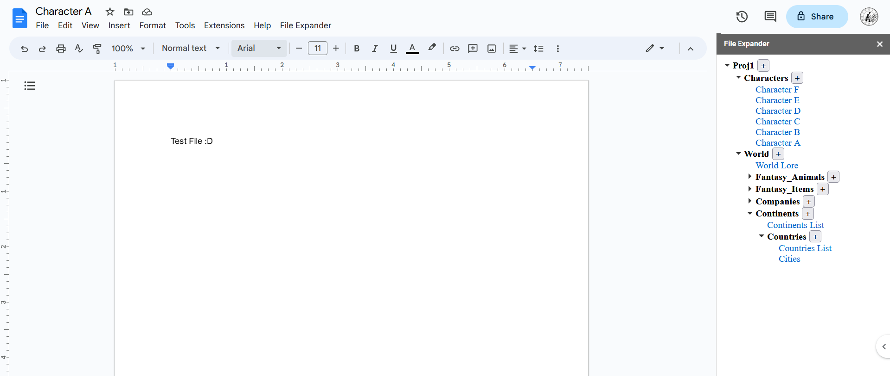

# Google_Doc_File_Tree

Version - (Experimental) - 3/31/23

This program seeks to improve workflow of creative writing by providing a pleasant interface for different folders and text documents. You can quickly open your files from the hyperlinks in the file-tree, expand/collapse folders if the interface gets too cluttered, and add new files directly into a chosen folder with one simple click.

#GUIDE
1. Create a folder in your Google Drive and name it FILE_EXPANDER. This will be the root directory for the program. 
2. Add Folders into FILE_EXPANDER for each of your projects.
